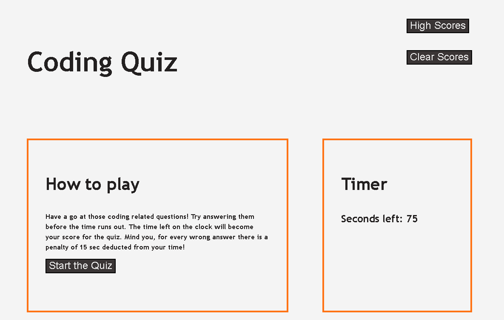
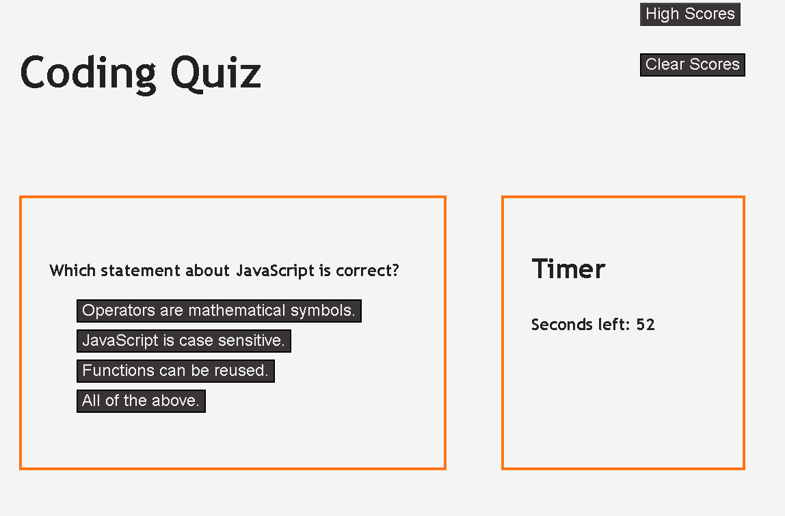
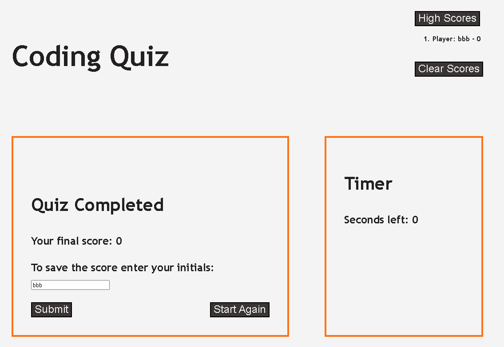

# Coding Quiz

## Project Description

Coding Quiz Challenge was created to test the user's general knowledge about coding.

## Links

You can try taking the quiz at [live page](https://voi-jankowski.github.io/code-quiz/) And here you can find the code for this project: [GitHub](https://github.com/voi-jankowski/code-quiz)

## Installation

N/A

## Usage

When you open the page you can see the instructions on how to play and the timer on the right.

Once you press Start the Quiz button the timer starts running and you are presented with the questions with multiple answers. Press the correct answer and you can hear 'Right' sound. If you chose incorrectly 'Wrong' sound could be heard and you are deducted 15 sec from your time.

After finishing you can enter your initials to save the score. Press High Scores button on the right to see the list of high scores. The button Clear Scores deletes those past scores.

## Credits

'Right' Sound Effect from Pixabay: https://pixabay.com/?utm_source=link-attribution&amp;utm_medium=referral&amp;utm_campaign=music&amp;utm_content=95630"

'Wrong' Sound Effect by Universfield: https://pixabay.com/users/universfield-28281460/?utm_source=link-attribution&amp;utm_medium=referral&amp;utm_campaign=music&amp;utm_content=126515 
from Pixabay: https://pixabay.com/sound-effects//?utm_source=link-attribution&amp;utm_medium=referral&amp;utm_campaign=music&amp;utm_content=126515

Some elements of solution for recording high scores sourced from https://michael-karen.medium.com/how-to-save-high-scores-in-local-storage-7860baca9d68

Coulor palette sourced from https://colorhunt.co/palette/f4f4f4ff73153a3535232020

## License

Please refer to the LICENSE in the repo.